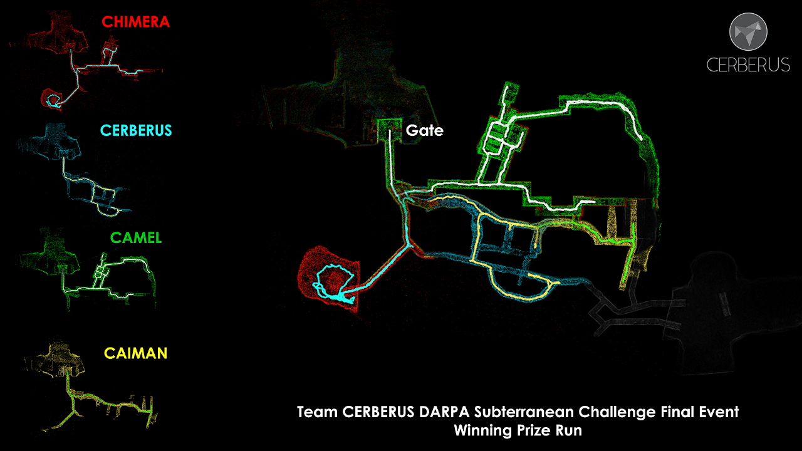
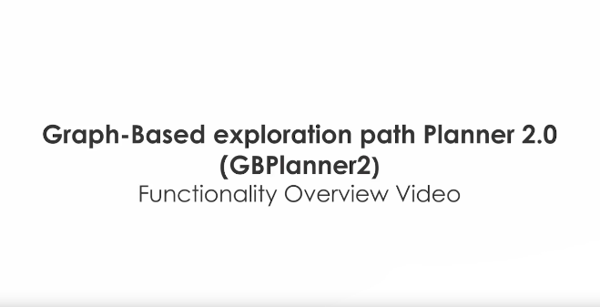

# Graph-based Exploration Planner 2.0


## Tutorial:
Please refer to the [wiki](https://github.com/ntnu-arl/gbplanner_ros/wiki) page for detailed instructions to install and run the demo simulations as well as documentation of the planner interface and parameters.
More results and video explaination of our method can be found on our website: [Link](https://www.autonomousrobotslab.com/exploration-planning.html)

## Installation
These instructions assume that ROS desktop-full of the appropriate ROS distro is installed.

Install necessary libraries:

For Ubuntu 18.04 and ROS Melodic:
```bash
sudo apt install python-catkin-tools \
libgoogle-glog-dev \
ros-melodic-joy \
ros-melodic-twist-mux \
ros-melodic-interactive-marker-twist-server \
ros-melodic-octomap-ros
```
For Ubuntu 20.04 and ROS Noetic:
```bash

sudo apt install python3-catkin-tools \
libgoogle-glog-dev \
ros-noetic-joy \
ros-noetic-twist-mux \
ros-noetic-interactive-marker-twist-server \
ros-noetic-octomap-ros
```


Create the workspace:
```bash
mkdir -p gbplanner2_ws/src/exploration
cd gbplanner2_ws/src/exploration
```
Clone the planner
```bash
git clone git@github.com:ntnu-arl/gbplanner_ros.git -b gbplanner2
```

Clone and update the required packages:
```bash
cd <path/to/gbplanner2_ws>
wstool init
wstool merge ./src/exploration/gbplanner_ros/packages_ssh.rosinstall
wstool update
```

`Note: ./src/exploration/gbplanner_ros/packages_https.rosinstall can be used for https based urls.`

Build:
```bash
catkin config -DCMAKE_BUILD_TYPE=Release
catkin build
```

## Running Planner Demo 
### Aerial Robot Demo
Download the gazebo model from [here](https://ntnu.box.com/s/45c4kb9ywr1kckhkxnzyd0vrcbn1w176) and extract in the `~/.gazebo/models` folder.
```bash
roslaunch gbplanner rmf_sim.launch
```
It will take few moments to load the world. A message saying the spawn_rmf_obelix process has died may pop up, but as long as the pointcloud map is visible in rviz and the UI controls work this message can be safely ignored.

### Ground Robot Demo
the following command:
```bash
roslaunch gbplanner smb_sim.launch
```
In Ubuntu 18.04 with ROS Melodic, the gazebo node might crash when running the ground robot simulation. In this case set the `gpu` parameter to false [here](https://github.com/ntnu-arl/smb_simulator/blob/6ed9d738ffd045d666311a8ba266570f58dca438/smb_description/urdf/sensor_head.urdf.xacro#L20).

## Results

Robot's of Team Cerberus running GBPlanner and GBPlanner2  


Autonomous exploration mission in the Prize Round of the DARPA Subterranean Challenge Final Event using four ANYmal C legged robots (Chimera, Cerberus, Camel, Caiman), all running GBPlanner2 independantly.



## References

### Explanation Video
[](https://www.youtube.com/watch?v=bTqFp1aODqU&list=PLu70ME0whad9Z4epZQ9VBYagKpyMyhZZ1&index=4)

If you use this work in your research, please cite the following publications:

**Graph-based subterranean exploration path planning using aerial and legged robots**
```
@article{dang2020graph,
  title={Graph-based subterranean exploration path planning using aerial and legged robots},
  author={Dang, Tung and Tranzatto, Marco and Khattak, Shehryar and Mascarich, Frank and Alexis, Kostas and Hutter, Marco},
  journal={Journal of Field Robotics},
  volume = {37},
  number = {8},
  pages = {1363-1388},  
  year={2020},
  note={Wiley Online Library}
}
```
**Autonomous Teamed Exploration of Subterranean Environments using Legged and Aerial Robots**
```
@INPROCEEDINGS{9812401,
  author={Kulkarni, Mihir and Dharmadhikari, Mihir and Tranzatto, Marco and Zimmermann, Samuel and Reijgwart, Victor and De Petris, Paolo and Nguyen, Huan and Khedekar, Nikhil and Papachristos, Christos and Ott, Lionel and Siegwart, Roland and Hutter, Marco and Alexis, Kostas},
  booktitle={2022 International Conference on Robotics and Automation (ICRA)}, 
  title={Autonomous Teamed Exploration of Subterranean Environments using Legged and Aerial Robots}, 
  year={2022},
  volume={},
  number={},
  pages={3306-3313},
  doi={10.1109/ICRA46639.2022.9812401}}
```

You can contact us for any question:
* [Tung Dang](mailto:tung.dang@nevada.unr.edu)
* [Mihir Dharmadhikari](mailto:mihir.dharmadhikari@ntnu.no)
* [Kostas Alexis](mailto:konstantinos.alexis@ntnu.no)
