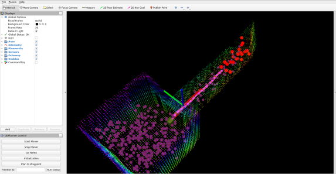

To demonstrate the use of the planner two demo scenarios involving a Resilient Micro Flyer aerial robot and a ground robot have been created in simulation.

Make sure that the [installation instructions](Installation) have been followed and the workspace is built.

## Aerial Robot Demo
A simulation model of the environment used for the Final Event of the DARPA Subterranean Challenge is used for this demo. The original model can be found [here](https://subtchallenge.world/OpenRobotics/fuel/models/MegaCavern)

Download the gazebo model from [here](https://drive.google.com/file/d/1Mx_JKNyx2MEwn56LM5KyP8Z3FM-4I6OS/view?usp=sharing) and extract in the `~/.gazebo/models` folder.


A model of Resilient Micro Flyer quadrotor robot called RMF-Obelix (used by Team Cerberus in the DARPA Subterranean Challenge Final Event) is used with [RotorS](https://github.com/ntnu-arl/rotors_simulator/tree/dev/rmf_obelix) simulator.

To run the demo, source the ```gbplanner2_ws``` and launch the demo launch file with the following command:
```bash
cd <path/to/gbplanner2_ws>
source devel/setup.bash
roslaunch gbplanner rmf_sim.launch
```
It will take few moments to load the world. A message saying the spawn_rmf_obelix process has died may pop up, but as long as the pointcloud map is visible in rviz and the UI controls work this message can be safely ignored.

This will launch the simulator, planner, controller and the rviz UI.  


Demo UI for RMF-Obelix

## Ground Robot Demo
The ground robot used for the simulation is a model of the SuperMegaBot equiped with two lidar sensors. 

To run the demo, source the ```gbplanner2_ws``` and launch the demo launch file with the following command:
```bash
cd <path/to/gbplanner2_ws>
source devel/setup.bash
roslaunch gbplanner smb_sim.launch
```
A message saying the spawn_smb_model process has died may pop up, but as long as the pointcloud map is visible in rviz and the UI controls work this message can be safely ignored.  
In Ubuntu 18.04 with ROS Melodic, the gazebo node might crash when running the ground robot simulation. In this case set the `gpu` parameter to false [here](https://github.com/ntnu-arl/smb_simulator/blob/6ed9d738ffd045d666311a8ba266570f58dca438/smb_description/urdf/sensor_head.urdf.xacro#L20).


  

Demo UI for SuperMegaBot

## Controlling the robots
A simple UI is provided for easy mission control (in the bottom left corner of the rviz window).  
Steps to start the planner:
- Click on the `Initialization` button.
- Once the robot finishes the initialization motion, click on `Start Planner`.

The robots will start the exploration and return to the location from which the planning was started within the time limit specified by the ros parameter `PlanningParams/time_budget_limit`. For more details about this check the [Parameters](Parameters) page.

### Description of the controls provided by the UI:

### 1. Initialization motion
At the beginning of the mission the robot needs to move to update the volumetric map and clear the space around it. To fascilitate this, an initialization behavior is provided. The robot follows a specific path defined in the `config/<robot_name>/planner_control_interface_config.yaml`. Note that the ```z_takeoff``` and ```z_drop``` parts of the path are only used for aerial robots.  
After launching the simulator, click on the ```Initialization``` button in the UI to perform initialization motion.  


### 2. Starting the planner
The ```Start Planner``` button starts the planner.  


### 3. Stopping the planner
The ```Stop Planner``` button starts the planner and brings the robot to a hault.  


### 4. Trigger homing manuever
The ```Go Home``` button will trigger the homing manuever. Note that this will be triggered after the robot completes its current path. To avoid this press ```Stop Planner``` before triggering homing. Once triggered, the planner will calculate a path from the current robot location to the location from which the planner was triggered for the first time, along the global graph.  


### 5. Plan to waypoint using the global graph
To send the robot to a specific location in the map the ```Plan to Waypoint``` functionality can be used. This will plan a path to a point on the global graph closest to the given waypoint.

First, the current planning behavior needs to be stopped. Press the ```Stop Planner``` button.

Second, the waypoint (pink arrow) needs to be set using the ```2D nav goal``` button:  
  

Then clicking the ```Plan to Waypoint``` button will calculate the path and send it to the robot to follow.  
  


## Using Custom World:
Any world file compatible with gazebo can be used with the simulation setup as follows:
- Add the following line to the world file:
    ```xml
    <plugin name='ros_interface_plugin' filename='librotors_gazebo_ros_interface_plugin.so'/>
    ```
- Set the `world_file` parameter in the launch file as done [here](https://github.com/ntnu-arl/gbplanner_ros/blob/59b06a0d575e2e7c82e1bf05c6f02b70b63c1806/gbplanner/launch/rmf/rmf_sim.launch#L16).
- Append the path to the models used in the world to the `GAZEBO_MODEL_PATH` as done [here](https://github.com/ntnu-arl/gbplanner_ros/blob/59b06a0d575e2e7c82e1bf05c6f02b70b63c1806/gbplanner/launch/rmf/rmf_sim.launch#L28) path.