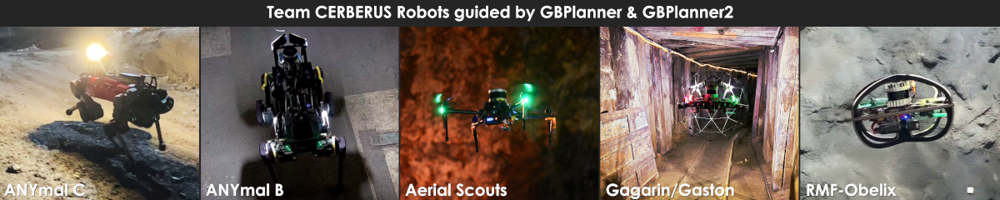
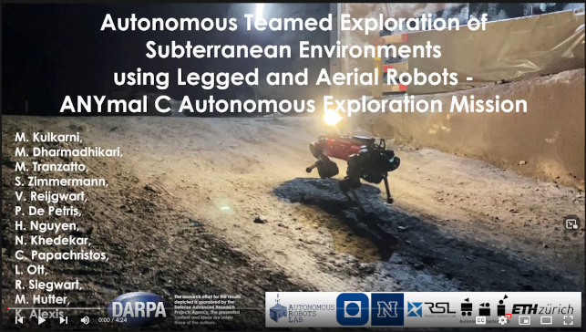
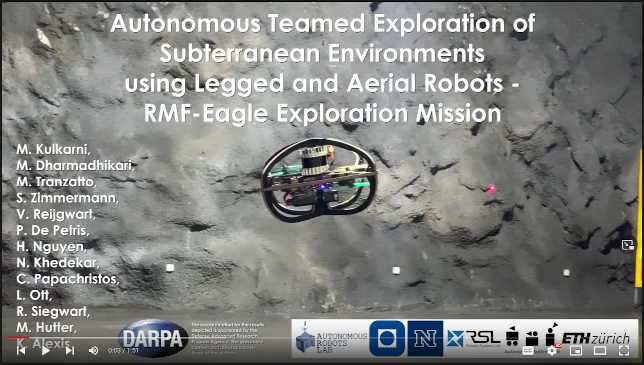
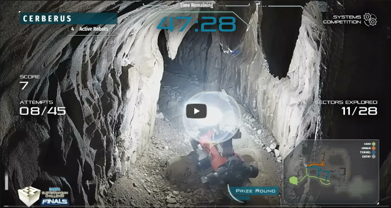

# GBPlanner2 Experimental Results

Robot's of Team Cerberus running GBPlanner and GBPlanner2  

## Field Evaluation

### ANYmal C Deployment in Hagerbach underground mine, Switzerland

### RMF-Obelix Aerial Robot Deployment in Hagerbach underground mine, Switzerland

### DARPA Subterranean Challenge Final Event Prize Run of Team Cerberus. Four ANYmal C robots running GBPlanner2

## Datasets
Coming soon ...